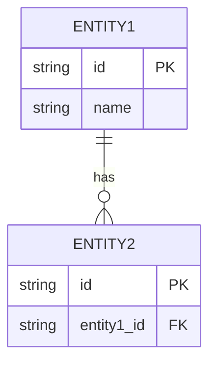

# Data Models

<!--
TEMPLATE INSTRUCTIONS:
Document the data structures and database schema used in the project.
Investigate: ORM models, database migrations, schema files, type definitions.
-->

## Overview

<!--
High-level description of the data architecture.
Include: database type, ORM used, key data concepts.
-->

## Entity Relationship Diagram

<!--
Provide a visual representation of how entities relate.
Use Mermaid, ASCII art, or reference an external diagram.
-->



## Entities

<!--
For each major entity/model, document:
- Purpose
- Fields with types
- Relationships
- Constraints/validations
- Indexes
-->

### EntityName

**Purpose:**

**Table/Collection:** `table_name`

**Fields:**

| Field      | Type      | Constraints  | Description           |
| ---------- | --------- | ------------ | --------------------- |
| id         | UUID      | PK, NOT NULL | Unique identifier     |
| created_at | TIMESTAMP | NOT NULL     | Creation timestamp    |
| updated_at | TIMESTAMP | NOT NULL     | Last update timestamp |
|            |           |              |                       |

**Relationships:**

- Has many `RelatedEntity` (via `foreign_key`)
- Belongs to `ParentEntity`

**Indexes:**

| Name | Columns | Type |
| ---- | ------- | ---- |
|      |         |      |

**Validations:**

-

### EntityName2

<!-- Repeat for each entity -->

## Enums / Constants

<!--
Document enum types and constant values used across entities.
-->

### StatusEnum

| Value       | Description |
| ----------- | ----------- |
| `PENDING`   |             |
| `ACTIVE`    |             |
| `COMPLETED` |             |

## Database Migrations

<!--
Explain how to run migrations and the migration strategy.
-->

### Running Migrations

```bash
# Command to run migrations
```

### Creating New Migrations

```bash
# Command to create a new migration
```

## Data Lifecycle

<!--
Document data retention, archival, and deletion policies if applicable.
-->

### Soft Delete

### Archival

### Data Retention
